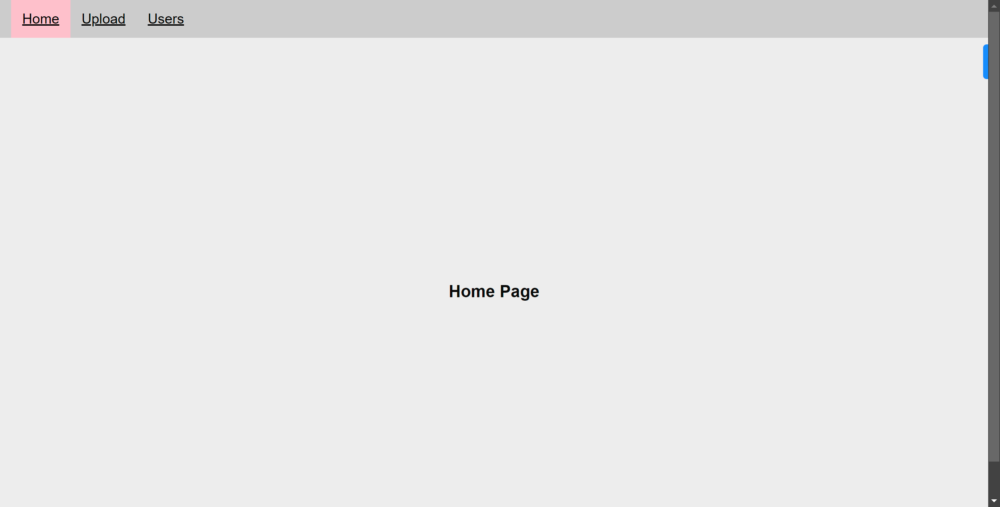
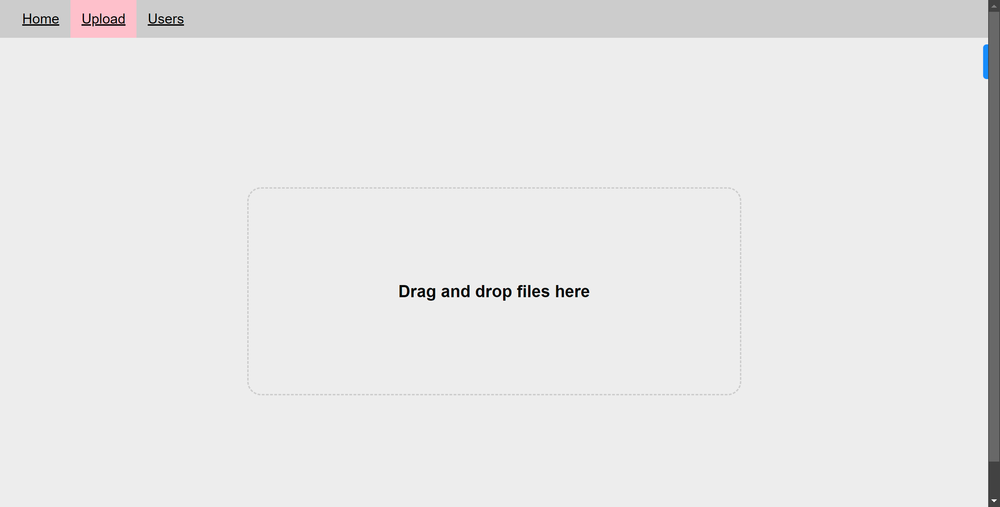
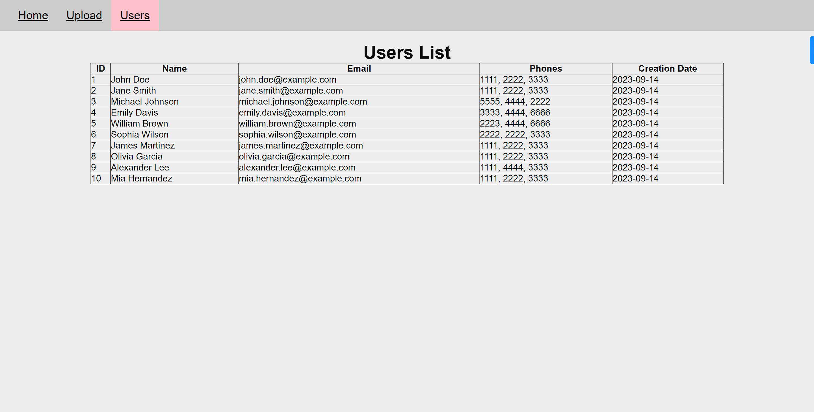

# CSV FILE UPLOADER

## Introduction

CSV Upload File which built using Next.js (React.js and Node.js), Ejs , CSS (as module) , JavaScript and mySQL.

## Features

- User can upload any csv file into the system - using Multer JS
- Display a list of all uploaded csv files - CSV is parsed and converted into JSON and stored in the mySQL Database
  <br/>
  <br/>

## Packages Install

- multer 
- csv-parser
- mysql12 
  <br/>

## Database

```
CREATE DATABASE users;
use users;

CREATE TABLE users(
  id INT AUTO_INCREMENT PRIMARY KEY,
  name VARCHAR(255),
  email VARCHAR(255),
  phone  VARCHAR(15),
  creationDate TIMESTAMP DEFAULT CURRENT_TIMESTAMP
);

```

### .env file

```
DB_HOST=localhost
DB_USER=admin
DB_PASS=admin
```

### `Run my project`

```
   npm install
   npm run dev
   Open [http://localhost:3000] view
```

### Screenshots :

## Home page



## Upload page



## Users page




------------\*\*\*-------------
